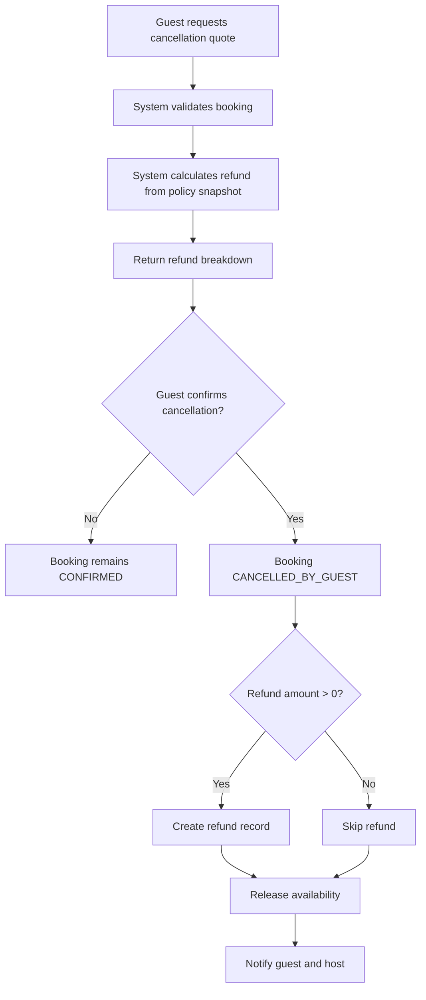
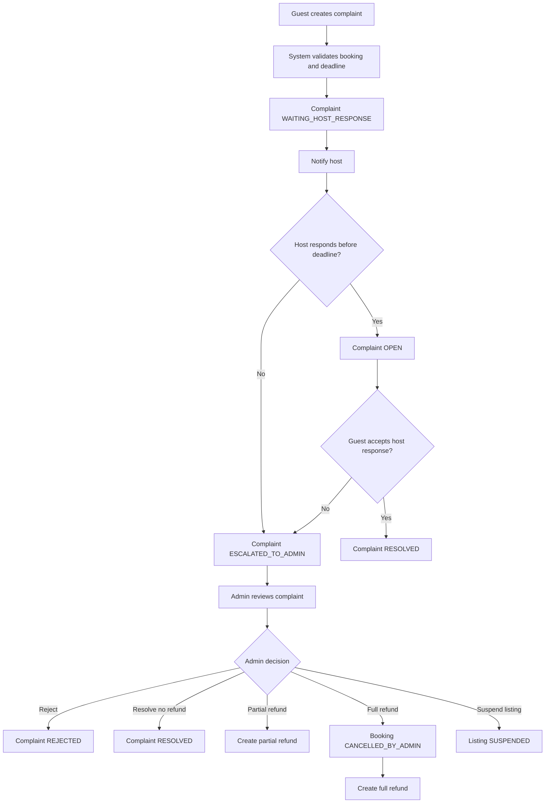
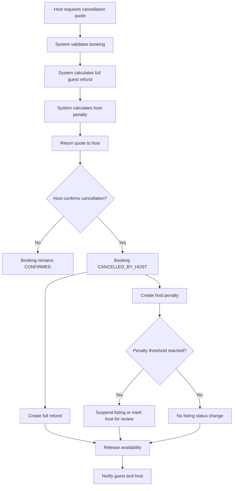

# Accommodation Booking System - Cancellation And Incident Business Specification

## 1. Purpose

Tài liệu này mô tả đặc tả nghiệp vụ chính thức cho các flow xử lý hủy booking, hoàn tiền, khiếu nại sau check-in và host penalty trong hệ thống đặt phòng lưu trú.

Tài liệu phục vụ trực tiếp cho Backend Developer, Frontend Developer và QA khi triển khai các nghiệp vụ:

- Guest hủy booking.
- Guest tạo complaint sau khi đến nơi.
- Host hủy booking.
- Admin xử lý complaint, refund, penalty và listing suspension.
- Hệ thống quản lý state transition liên quan đến cancellation và incident handling.

## 2. Actors

| Actor | Description | Responsibilities |
|---|---|---|
| `GUEST` | Người đặt phòng | Xem booking, yêu cầu cancellation quote, xác nhận hủy booking, tạo complaint, gửi evidence, escalate complaint |
| `HOST` | Chủ chỗ ở | Xem booking, yêu cầu cancellation quote, xác nhận hủy booking, phản hồi complaint |
| `ADMIN` | Người vận hành hệ thống | Xử lý complaint, duyệt refund, miễn penalty, khóa/mở listing |
| `SYSTEM` | Tác vụ tự động | Tính refund, tính penalty, cập nhật trạng thái, tạo refund record, mở lại availability, gửi notification |

## 3. Status Definitions

### 3.1. Booking Status bổ sung

| Status | Description | Terminal |
|---|---|---|
| `CONFIRMED` | Booking đã được xác nhận và chưa check-in | No |
| `CHECKED_IN` | Guest đã check-in | No |
| `COMPLETED` | Booking đã hoàn tất sau checkout | Yes |
| `CANCELLED_BY_GUEST` | Booking bị hủy bởi guest | Yes |
| `CANCELLED_BY_HOST` | Booking bị hủy bởi host | Yes |
| `CANCELLED_BY_ADMIN` | Booking bị hủy bởi admin do complaint hoặc can thiệp vận hành | Yes |

### 3.2. Complaint Status

| Status | Description |
|---|---|
| `WAITING_HOST_RESPONSE` | Complaint đã được tạo và đang chờ host phản hồi |
| `OPEN` | Host đã phản hồi, guest đang xem xét |
| `ESCALATED_TO_ADMIN` | Complaint đã được chuyển admin xử lý |
| `RESOLVED` | Complaint đã được xử lý |
| `REJECTED` | Complaint bị từ chối |
| `CLOSED` | Complaint đã đóng |

### 3.3. Listing Status

| Status | Description |
|---|---|
| `ACTIVE` | Listing có thể được đặt |
| `SUSPENDED` | Listing bị khóa bởi hệ thống hoặc admin |

## 4. Global Business Rules

- Booking phải lưu snapshot giá và cancellation policy tại thời điểm booking được xác nhận.
- Các flow trong tài liệu này chỉ áp dụng cho booking đã thanh toán.
- Terminal booking status không được chuyển ngược về trạng thái active.
- Refund amount không được vượt quá remaining refundable amount của booking.
- Guest cancellation và host cancellation phải đi qua bước quote trước khi xác nhận.
- API tạo cancellation, refund và admin decision phải hỗ trợ idempotency.
- Hệ thống phải tạo notification cho các sự kiện cancellation, refund, complaint, penalty và listing suspension.

## 5. Flow: Guest Cancels Booking

### Actor

`GUEST`, `SYSTEM`

### Trigger

Guest mở chi tiết booking và yêu cầu hủy booking.

### Preconditions

- Guest đã đăng nhập.
- Booking thuộc về guest hiện tại.
- Booking status là `CONFIRMED`.
- Payment status là `PAID`.
- Booking chưa `CHECKED_IN`.
- Booking chưa ở terminal status.

### Business Rules

- Guest phải tạo cancellation quote trước khi hủy.
- Cancellation quote phải gồm:
  - `refund_amount`
  - `non_refundable_amount`
  - `service_fee_refund`
  - `cleaning_fee_refund`
  - `policy_code`
  - `expires_at`
- Guest chỉ được xác nhận hủy bằng quote còn hiệu lực.
- Khi guest xác nhận hủy, booking chuyển sang `CANCELLED_BY_GUEST`.
- Nếu `refund_amount > 0`, hệ thống tạo refund record.
- Payment status chuyển sang `REFUND_PENDING` khi refund được tạo.
- Availability của listing được mở lại cho khoảng ngày đã hủy.
- Host và guest nhận notification sau khi hủy thành công.

### Cancellation Policies

| Policy | Cancellation Time | Guest Refund |
|---|---|---:|
| `FLEXIBLE` | Từ 24 giờ trở lên trước check-in | 100% tiền phòng + cleaning fee + service fee |
| `FLEXIBLE` | Dưới 24 giờ trước check-in | Refund các đêm chưa ở, trừ đêm đầu tiên; không refund service fee |
| `MODERATE` | Từ 5 ngày trở lên trước check-in | 100% tiền phòng + cleaning fee + service fee |
| `MODERATE` | Từ 1 đến dưới 5 ngày trước check-in | 50% tiền phòng + 100% cleaning fee; không refund service fee |
| `MODERATE` | Dưới 24 giờ trước check-in | Không refund tiền phòng; refund cleaning fee nếu chưa check-in |
| `STRICT` | Từ 7 ngày trở lên trước check-in | 50% tiền phòng + 100% cleaning fee; không refund service fee |
| `STRICT` | Dưới 7 ngày trước check-in | Không refund tiền phòng; refund cleaning fee nếu chưa check-in |

Additional rules:

- `service_fee` chỉ được refund khi guest được full refund.
- `cleaning_fee` được refund nếu guest chưa check-in.
- Booking `CHECKED_IN` không được guest hủy bằng cancellation flow.
- Booking `COMPLETED` không được hủy.

### State Transitions

| Entity | From | Event | To |
|---|---|---|---|
| Booking | `CONFIRMED` | Guest confirms cancellation | `CANCELLED_BY_GUEST` |
| Payment | `PAID` | Refund created | `REFUND_PENDING` |
| Payment | `REFUND_PENDING` | Refund completed fully | `REFUNDED` |
| Payment | `REFUND_PENDING` | Refund completed partially | `PARTIALLY_REFUNDED` |
| Payment | `REFUND_PENDING` | Refund failed | `FAILED` |

### Flow Diagram



## 6. Flow: Guest Creates Complaint After Check-In

### Actor

`GUEST`, `HOST`, `ADMIN`, `SYSTEM`

### Trigger

Guest phát hiện sự cố sau khi đã check-in và tạo complaint từ booking detail.

### Preconditions

- Guest đã đăng nhập.
- Booking thuộc về guest hiện tại.
- Booking status là `CHECKED_IN`.
- Payment status là `PAID`, `PARTIALLY_REFUNDED` hoặc `REFUND_PENDING`.
- Complaint được tạo trong vòng 24 giờ sau check-in.
- Booking chưa có complaint active khác.

### Complaint Types

| Type | Description |
|---|---|
| `CANNOT_CHECK_IN` | Guest không thể vào chỗ ở hoặc không có hướng dẫn check-in hợp lệ |
| `NOT_AS_DESCRIBED` | Chỗ ở sai mô tả nghiêm trọng |
| `UNCLEAN` | Chỗ ở không sạch sẽ |
| `MISSING_AMENITY` | Thiếu tiện nghi quan trọng đã được công bố |
| `SAFETY_ISSUE` | Có vấn đề an toàn hoặc rủi ro sức khỏe |

### Business Rules

- Complaint phải có `type` và `description`.
- Guest có thể upload evidence dạng ảnh hoặc video.
- Khi complaint được tạo, status là `WAITING_HOST_RESPONSE`.
- Host nhận notification khi complaint được tạo.
- Host có thể phản hồi complaint và đưa ra phương án xử lý.
- Sau khi host phản hồi, complaint chuyển sang `OPEN`.
- Guest có thể chấp nhận phản hồi của host; complaint chuyển `RESOLVED`.
- Guest có thể escalate complaint nếu không chấp nhận phản hồi của host.
- Hệ thống tự động escalate complaint nếu host không phản hồi trước deadline.
- Admin chỉ xử lý complaint ở trạng thái `ESCALATED_TO_ADMIN`.
- Admin có thể reject complaint, resolve without refund, partial refund hoặc full refund.
- Full refund do admin quyết định sẽ chuyển booking sang `CANCELLED_BY_ADMIN`.
- Complaint nghiêm trọng có thể làm listing chuyển `SUSPENDED`.

### Admin Resolution Rules

| Complaint Type | Allowed Admin Actions |
|---|---|
| `CANNOT_CHECK_IN` | `FULL_REFUND`, `REJECT`, `SUSPEND_LISTING` |
| `NOT_AS_DESCRIBED` | `PARTIAL_REFUND`, `FULL_REFUND`, `REJECT`, `SUSPEND_LISTING` |
| `UNCLEAN` | `RESOLVE_NO_REFUND`, `PARTIAL_REFUND`, `REJECT` |
| `MISSING_AMENITY` | `RESOLVE_NO_REFUND`, `PARTIAL_REFUND`, `REJECT` |
| `SAFETY_ISSUE` | `FULL_REFUND`, `REJECT`, `SUSPEND_LISTING` |

### Complaint State Transitions

| From | Event | To |
|---|---|---|
| None | Guest creates complaint | `WAITING_HOST_RESPONSE` |
| `WAITING_HOST_RESPONSE` | Host responds | `OPEN` |
| `WAITING_HOST_RESPONSE` | Host response timeout | `ESCALATED_TO_ADMIN` |
| `OPEN` | Guest accepts host response | `RESOLVED` |
| `OPEN` | Guest escalates | `ESCALATED_TO_ADMIN` |
| `ESCALATED_TO_ADMIN` | Admin resolves | `RESOLVED` |
| `ESCALATED_TO_ADMIN` | Admin rejects | `REJECTED` |
| `RESOLVED` | System closes case | `CLOSED` |
| `REJECTED` | System closes case | `CLOSED` |

### Booking And Payment State Transitions

| Entity | From | Event | To |
|---|---|---|---|
| Booking | `CHECKED_IN` | Admin full refund | `CANCELLED_BY_ADMIN` |
| Booking | `CHECKED_IN` | Complaint resolved without cancellation | `CHECKED_IN` |
| Payment | `PAID` | Partial refund created | `REFUND_PENDING` |
| Payment | `PAID` | Full refund created | `REFUND_PENDING` |
| Payment | `REFUND_PENDING` | Refund completed partially | `PARTIALLY_REFUNDED` |
| Payment | `REFUND_PENDING` | Refund completed fully | `REFUNDED` |
| Listing | `ACTIVE` | Admin or system suspends listing | `SUSPENDED` |

### Flow Diagram



## 7. Flow: Host Cancels Booking

### Actor

`HOST`, `SYSTEM`, `ADMIN`

### Trigger

Host mở chi tiết booking và yêu cầu hủy booking.

### Preconditions

- Host đã đăng nhập.
- Host là chủ của listing trong booking.
- Booking status là `CONFIRMED`.
- Payment status là `PAID`.
- Booking chưa `CHECKED_IN`.
- Booking chưa ở terminal status.

### Business Rules

- Host phải tạo cancellation quote trước khi hủy.
- Host cancellation quote phải hiển thị:
  - `guest_refund_amount`
  - `penalty_points`
  - `reason_code`
  - `penalty_threshold_result`
- Guest luôn được full refund khi host hủy booking.
- Khi host xác nhận hủy, booking chuyển sang `CANCELLED_BY_HOST`.
- Hệ thống tạo refund record cho guest.
- Hệ thống tạo host penalty record theo thời điểm hủy.
- Availability của listing được mở lại cho khoảng ngày đã hủy.
- Listing bị `SUSPENDED` nếu host đạt ngưỡng penalty.
- Admin có thể miễn penalty bằng action `WAIVE_PENALTY`.

### Host Penalty Rules

| Cancellation Time | Penalty |
|---|---:|
| Trên 7 ngày trước check-in | 1 point |
| Từ 1 đến 7 ngày trước check-in | 2 points |
| Dưới 24 giờ trước check-in | 3 points |

Penalty thresholds:

| Condition | System Action |
|---|---|
| 3 cancellations within 90 days | Suspend listing for 7 days |
| 5 cancellations within 180 days | Mark host for admin review |

Host cancellation reasons:

- `PROPERTY_DAMAGE`
- `PERSONAL_EMERGENCY`
- `DOUBLE_BOOKING`
- `UNAVAILABLE`
- `OTHER`

### State Transitions

| Entity | From | Event | To |
|---|---|---|---|
| Booking | `CONFIRMED` | Host confirms cancellation | `CANCELLED_BY_HOST` |
| Payment | `PAID` | Full refund created | `REFUND_PENDING` |
| Payment | `REFUND_PENDING` | Refund completed | `REFUNDED` |
| Payment | `REFUND_PENDING` | Refund failed | `FAILED` |
| Listing | `ACTIVE` | Penalty threshold reached | `SUSPENDED` |

### Flow Diagram



## 8. Admin Operations

### 8.1. Resolve Complaint

Actor: `ADMIN`

Trigger: Admin xử lý complaint đang `ESCALATED_TO_ADMIN`.

Business rules:

- Admin phải nhập `decision` và `admin_note`.
- Decision hợp lệ gồm `REJECT`, `RESOLVE_NO_REFUND`, `PARTIAL_REFUND`, `FULL_REFUND`.
- Với `PARTIAL_REFUND`, `refund_amount` phải lớn hơn 0 và nhỏ hơn remaining refundable amount.
- Với `FULL_REFUND`, hệ thống tạo refund cho toàn bộ remaining refundable amount.
- Với `FULL_REFUND`, booking chuyển `CANCELLED_BY_ADMIN`.
- Admin có thể suspend listing nếu complaint type là `SAFETY_ISSUE`, `CANNOT_CHECK_IN` hoặc `NOT_AS_DESCRIBED`.

### 8.2. Waive Host Penalty

Actor: `ADMIN`

Trigger: Admin xem penalty của host và thực hiện miễn penalty.

Business rules:

- Chỉ penalty đang active mới được waive.
- Admin phải nhập `reason` khi miễn penalty.
- Penalty sau khi waive không được tính vào threshold.

### 8.3. Suspend Or Unsuspend Listing

Actor: `ADMIN`, `SYSTEM`

Trigger:

- Admin suspend listing thủ công.
- System suspend listing khi host đạt ngưỡng penalty.
- Admin unsuspend listing sau khi review.

Business rules:

- Listing `SUSPENDED` không được nhận booking mới.
- Existing booking không tự động bị hủy khi listing bị suspend.
- Admin phải nhập reason khi suspend hoặc unsuspend listing.

## 9. API Requirements

### 9.1. Guest APIs

```http
GET    /api/bookings/me
GET    /api/bookings/{bookingId}

POST   /api/bookings/{bookingId}/cancel/quote
POST   /api/bookings/{bookingId}/cancel

POST   /api/bookings/{bookingId}/complaints
GET    /api/complaints/me
GET    /api/complaints/{complaintId}
POST   /api/complaints/{complaintId}/evidence
POST   /api/complaints/{complaintId}/messages
POST   /api/complaints/{complaintId}/accept-host-response
POST   /api/complaints/{complaintId}/escalate
```

### 9.2. Host APIs

```http
GET    /api/host/bookings
GET    /api/host/bookings/{bookingId}

POST   /api/host/bookings/{bookingId}/cancel/quote
POST   /api/host/bookings/{bookingId}/cancel

GET    /api/host/complaints
GET    /api/host/complaints/{complaintId}
POST   /api/host/complaints/{complaintId}/response

GET    /api/host/penalties
```

### 9.3. Admin APIs

```http
GET    /api/admin/bookings
GET    /api/admin/bookings/{bookingId}

GET    /api/admin/complaints
GET    /api/admin/complaints/{complaintId}
POST   /api/admin/complaints/{complaintId}/resolve
POST   /api/admin/complaints/{complaintId}/reject

POST   /api/admin/bookings/{bookingId}/force-cancel
POST   /api/admin/refunds/{refundId}/approve

GET    /api/admin/hosts/{hostId}/penalties
POST   /api/admin/hosts/{hostId}/waive-penalty
POST   /api/admin/listings/{listingId}/suspend
POST   /api/admin/listings/{listingId}/unsuspend
```

## 10. Data Requirements

### 10.1. Booking Fields Used By These Flows

```sql
bookings (
  id,
  listing_id,
  guest_id,
  host_id,
  check_in_date,
  check_out_date,
  status,
  payment_status,
  cancellation_policy_code,
  nightly_price,
  nights,
  cleaning_fee,
  service_fee,
  total_amount,
  cancelled_by,
  cancelled_at,
  cancellation_reason,
  created_at,
  updated_at
)
```

### 10.2. Cancellation Quotes

```sql
cancellation_quotes (
  id,
  booking_id,
  actor_type,
  policy_code,
  refund_amount,
  non_refundable_amount,
  service_fee_refund,
  cleaning_fee_refund,
  penalty_points,
  reason_code,
  expires_at,
  created_at
)
```

### 10.3. Refunds

```sql
refunds (
  id,
  booking_id,
  cancellation_quote_id,
  complaint_id,
  amount,
  status,
  reason,
  payment_provider_ref,
  created_at,
  updated_at
)
```

### 10.4. Complaints

```sql
complaints (
  id,
  booking_id,
  guest_id,
  host_id,
  type,
  status,
  description,
  requested_resolution,
  host_response,
  admin_decision,
  admin_note,
  refund_amount,
  created_at,
  resolved_at
)
```

### 10.5. Complaint Evidence

```sql
complaint_evidence (
  id,
  complaint_id,
  file_url,
  file_type,
  description,
  created_at
)
```

### 10.6. Host Penalties

```sql
host_penalties (
  id,
  host_id,
  listing_id,
  booking_id,
  points,
  reason,
  status,
  waived_by_admin_id,
  created_at
)
```

## 11. Notification Events

| Event | Recipients |
|---|---|
| `BOOKING_CANCELLED_BY_GUEST` | Guest, Host |
| `BOOKING_CANCELLED_BY_HOST` | Guest, Host |
| `BOOKING_CANCELLED_BY_ADMIN` | Guest, Host |
| `REFUND_CREATED` | Guest |
| `REFUND_COMPLETED` | Guest |
| `REFUND_FAILED` | Guest, Admin |
| `COMPLAINT_CREATED` | Host |
| `COMPLAINT_ESCALATED` | Admin |
| `COMPLAINT_RESOLVED` | Guest, Host |
| `COMPLAINT_REJECTED` | Guest, Host |
| `HOST_PENALTY_CREATED` | Host |
| `HOST_PENALTY_WAIVED` | Host |
| `LISTING_SUSPENDED` | Host, Admin |
| `LISTING_UNSUSPENDED` | Host, Admin |

## 12. Acceptance Criteria

### 12.1. Guest Cancellation

- Guest xem được cancellation quote trước khi hủy.
- Guest chỉ hủy được booking `CONFIRMED`.
- Guest không hủy được booking `CHECKED_IN` hoặc `COMPLETED`.
- Booking chuyển `CANCELLED_BY_GUEST` sau khi guest xác nhận hủy.
- Refund record được tạo đúng cancellation policy.
- Availability được mở lại sau khi hủy.
- Notification được gửi cho guest và host.

### 12.2. Guest Complaint

- Guest chỉ tạo complaint cho booking `CHECKED_IN`.
- Complaint phải có type và description.
- Mỗi booking chỉ có một complaint active tại một thời điểm.
- Host phản hồi được khi complaint `WAITING_HOST_RESPONSE`.
- Guest có thể accept host response hoặc escalate.
- Complaint tự động escalate nếu host không phản hồi trước deadline.
- Admin chỉ xử lý complaint ở trạng thái `ESCALATED_TO_ADMIN`.
- Full refund do admin làm booking chuyển `CANCELLED_BY_ADMIN`.

### 12.3. Host Cancellation

- Host chỉ hủy được booking `CONFIRMED`.
- Host không hủy được booking `CHECKED_IN` hoặc `COMPLETED`.
- Guest luôn nhận full refund khi host hủy.
- Booking chuyển `CANCELLED_BY_HOST` sau khi host xác nhận hủy.
- Host penalty được tạo đúng theo thời điểm hủy.
- Listing bị suspend khi đạt ngưỡng penalty.
- Admin có thể waive penalty.

### 12.4. Refund

- Refund amount không được vượt quá remaining refundable amount.
- Refund phải liên kết với booking và nguyên nhân refund.
- Payment status cập nhật theo kết quả refund.
- Refund failed phải tạo notification cho admin.

### 12.5. Terminal State

- Booking ở terminal status không được cập nhật về active status.
- Booking `COMPLETED` không được hủy.
- Booking `CANCELLED_BY_GUEST`, `CANCELLED_BY_HOST` và `CANCELLED_BY_ADMIN` không được tạo complaint mới.
