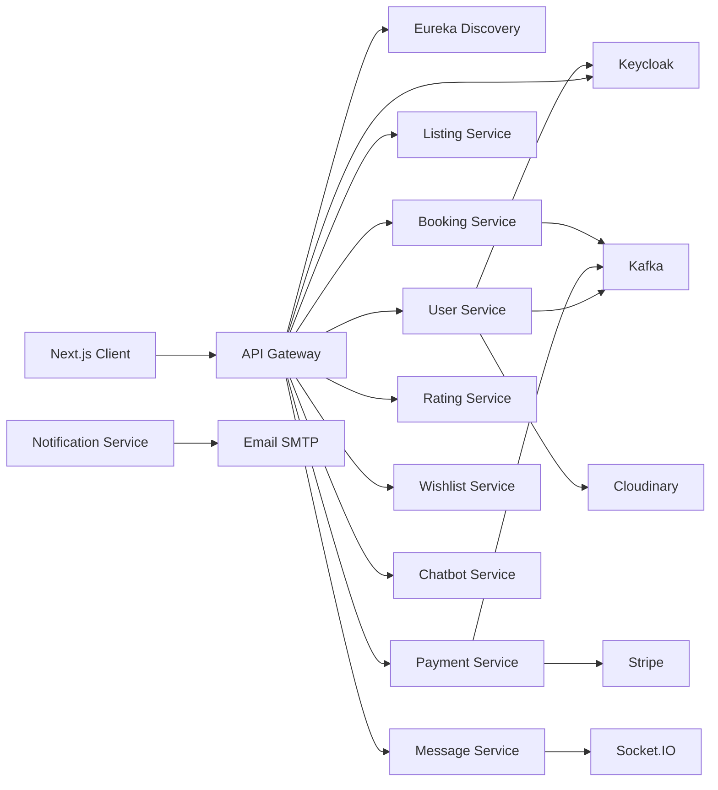
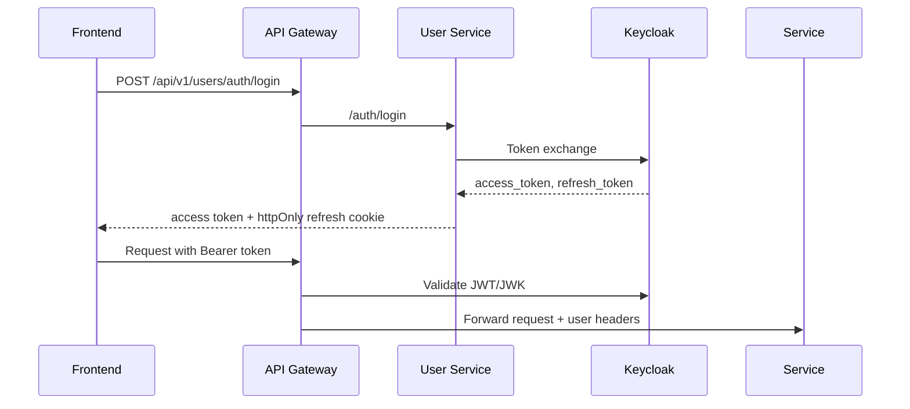
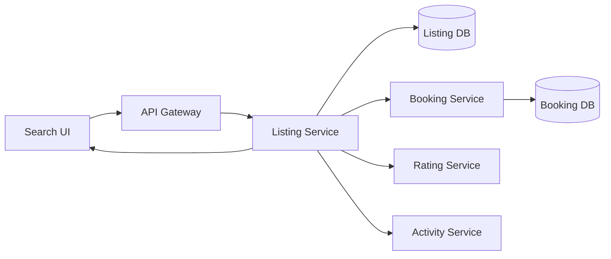
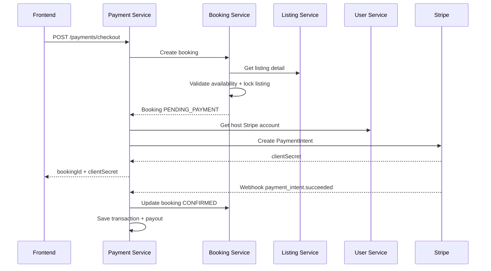
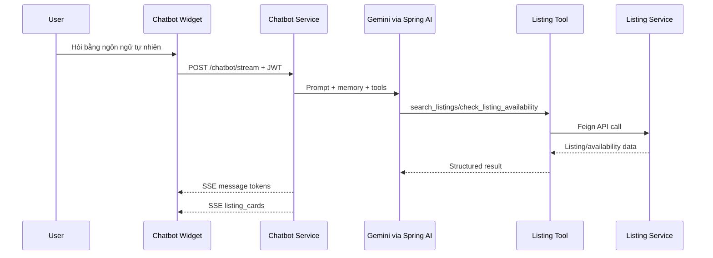
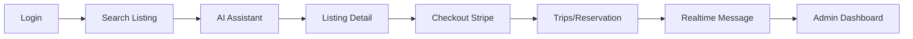

# Dàn ý slide bảo vệ đồ án tốt nghiệp: Airbnb Clone Microservices

Thời lượng đề xuất: 10-15 phút  
Định hướng trình bày: tập trung vào giá trị kỹ thuật, kiến trúc microservices, luồng nghiệp vụ chính và phần AI hỗ trợ người dùng.  
Nguồn phân tích: `docker-compose.yml`, cấu hình Spring/Next.js, controller/service chính của các service trong source code hiện tại.

## Tổng quan thời lượng

- Introduction and Motivation: 2 phút
- System Design and Tech Stack: 5-6 phút
- AI Processing Layer: 2-3 phút
- Conclusion and Future Work: 2 phút
- Demonstration: 3-5 phút

## Slide 1. Giới thiệu đề tài

**Nội dung chính**

- Tên đề tài: Xây dựng hệ thống Airbnb Clone theo kiến trúc microservices.
- Hệ thống mô phỏng nền tảng đặt chỗ lưu trú trực tuyến với các vai trò: khách, chủ nhà và quản trị viên.
- Các nhóm chức năng chính:
  - Tìm kiếm và xem chi tiết nơi lưu trú.
  - Đăng ký, đăng nhập, quản lý hồ sơ.
  - Tạo listing cho host.
  - Đặt phòng, thanh toán, quản lý chuyến đi.
  - Đánh giá, wishlist, nhắn tin realtime.
  - Chatbot AI hỗ trợ tìm kiếm và tư vấn phòng.

**Gợi ý lời thuyết trình**

"Đề tài của em là xây dựng một hệ thống Airbnb Clone theo kiến trúc microservices. Mục tiêu không chỉ là làm một ứng dụng đặt phòng cơ bản, mà là mô phỏng một hệ thống marketplace có nhiều miền nghiệp vụ tách biệt như user, listing, booking, payment, rating, message và AI assistant. Qua đó em tập trung vào cách thiết kế hệ thống backend phân tán, tích hợp xác thực, thanh toán, realtime messaging và recommendation."

**Hình minh họa nên đưa vào**

- Ảnh chụp màn hình trang chủ hoặc trang tìm kiếm của hệ thống.
- Một sơ đồ ngắn: Guest - Host - Admin tương tác trên cùng nền tảng.

## Slide 2. Lý do chọn đề tài và vấn đề thực tế

**Nội dung chính**

- Airbnb là dạng hệ thống marketplace điển hình, có nhiều nghiệp vụ thực tế:
  - Người dùng cần tìm nơi ở theo vị trí, giá, tiện ích, số khách và ngày trống.
  - Host cần quản lý listing, lịch trống, giá và reservation.
  - Hệ thống cần xử lý thanh toán, trạng thái booking, hoàn tiền và thông báo.
- Bài toán phù hợp để áp dụng microservices vì mỗi nghiệp vụ có dữ liệu, luồng xử lý và tốc độ thay đổi khác nhau.
- Thách thức kỹ thuật:
  - Đồng bộ trạng thái booking và payment.
  - Xác thực người dùng qua nhiều service.
  - Giao tiếp realtime.
  - Tích hợp AI nhưng vẫn dùng dữ liệu thật từ backend.

**Gợi ý lời thuyết trình**

"Em chọn đề tài này vì đây là một bài toán gần với thực tế, có nhiều nghiệp vụ độc lập nhưng phải phối hợp chặt chẽ. Ví dụ, khi người dùng đặt phòng, hệ thống phải kiểm tra phòng còn trống, tạo booking, tạo thanh toán qua Stripe, nhận webhook và cập nhật trạng thái booking. Đây là một bài toán tốt để chứng minh khả năng thiết kế hệ thống backend thay vì chỉ làm CRUD đơn giản."

**Hình minh họa nên đưa vào**

- Một sơ đồ vấn đề: Search -> Booking -> Payment -> Notification -> Trip management.

## Slide 3. Mục tiêu đồ án

**Nội dung chính**

- Xây dựng ứng dụng web Airbnb Clone có frontend, backend và hạ tầng chạy bằng Docker Compose.
- Thiết kế backend theo microservices, mỗi service phụ trách một miền nghiệp vụ riêng.
- Sử dụng API Gateway và Service Discovery để điều phối request.
- Tích hợp Keycloak cho authentication/authorization.
- Tích hợp Stripe cho checkout, webhook, refund và payout.
- Tích hợp Kafka cho thông báo bất đồng bộ.
- Tích hợp Socket.IO cho nhắn tin realtime.
- Tích hợp AI chatbot để tìm kiếm, tư vấn listing và kiểm tra availability.

**Gợi ý lời thuyết trình**

"Mục tiêu của đồ án là xây dựng một hệ thống đủ hoàn chỉnh để demo các luồng chính của một nền tảng đặt phòng. Về kỹ thuật, em muốn thể hiện được kiến trúc microservices, cách tách database theo service, cách bảo vệ API bằng Keycloak, cách xử lý thanh toán qua Stripe và cách đưa AI vào hệ thống nhưng vẫn kiểm soát dữ liệu bằng API nội bộ."

**Hình minh họa nên đưa vào**

- Checklist mục tiêu kỹ thuật và nghiệp vụ.

## Slide 4. Kiến trúc tổng quan hệ thống

**Nội dung chính**

- Frontend: `airbnb-client` dùng Next.js, React, TypeScript.
- API Gateway: `api-gateway` dùng Spring Cloud Gateway WebFlux, route `/api/v1/...` về từng service.
- Service Discovery: `discovery-service` dùng Eureka.
- Backend microservices:
  - `user-service`
  - `listing-service`
  - `booking-service`
  - `payment-service`
  - `rating-service`
  - `wishlist-service`
  - `activity-service`
  - `chatbot-service`
  - `notification-service`
  - `message-service`
- Infrastructure:
  - Keycloak cho OAuth2/JWT.
  - Kafka cho event.
  - PostgreSQL/Neon cho dữ liệu nghiệp vụ chính.
  - MongoDB cho notification/message.
  - Stripe, Cloudinary, SMTP.

**Gợi ý lời thuyết trình**

"Về tổng quan, người dùng truy cập hệ thống qua frontend Next.js. Các request HTTP đi qua API Gateway. Gateway chịu trách nhiệm CORS, xác thực JWT với Keycloak và route request đến service tương ứng thông qua Eureka. Mỗi service backend xử lý một miền nghiệp vụ riêng và có database riêng. Những nghiệp vụ cần realtime hoặc bất đồng bộ được xử lý qua Socket.IO và Kafka."

**Hình minh họa nên đưa vào**

- Sơ đồ kiến trúc tổng quan:

## Slide 5. Vai trò các microservice chính

**Nội dung chính**

| Service | Vai trò |
| --- | --- |
| `user-service` | Đăng ký, đăng nhập, refresh token, hồ sơ user, avatar, Stripe Connect onboarding cho host |
| `listing-service` | Quản lý listing, ảnh, tiện ích, pricing, house rules, access info, availability, search nâng cao |
| `booking-service` | Tạo booking, kiểm tra trùng lịch, trạng thái reservation, trip, cancellation, complaint, host penalty |
| `payment-service` | Checkout Stripe, webhook, payment, transaction, refund, payout, audit payment |
| `rating-service` | Đánh giá listing và host, average rating, rating summary |
| `wishlist-service` | Bộ sưu tập yêu thích và item wishlist |
| `activity-service` | Ghi nhận hành vi user và collaborative filtering recommendation |
| `message-service` | Nhắn tin realtime, conversation, message media, reaction, recall |
| `notification-service` | Gửi email theo template, nhận Kafka event đăng ký user |
| `chatbot-service` | AI assistant dùng Spring AI, Gemini và tool gọi listing-service |

**Gợi ý lời thuyết trình**

"Em chia hệ thống theo domain nghiệp vụ. Ví dụ listing-service chỉ tập trung vào nơi lưu trú và lịch trống, booking-service tập trung vào vòng đời reservation, còn payment-service tập trung vào Stripe và các nghiệp vụ tiền như refund, payout. Cách tách này giúp mỗi service có ownership rõ ràng, dễ mở rộng và giảm phụ thuộc trực tiếp giữa các nhóm chức năng."

**Hình minh họa nên đưa vào**

- Bảng service như trên.
- Có thể thêm icon nhỏ cho từng domain: User, Home, Calendar, Payment, Chat.

## Slide 6. Tech stack và lý do lựa chọn

**Nội dung chính**

| Nhóm | Công nghệ |
| --- | --- |
| Frontend | Next.js 16, React 19, TypeScript, Tailwind CSS, Redux Toolkit/Zustand, Socket.IO client, Stripe React |
| Backend Java | Spring Boot 4, Java 21, Spring MVC/WebFlux, Spring Security OAuth2 Resource Server |
| Backend Node.js | Express 5, Socket.IO, Mongoose, Babel |
| Service discovery/gateway | Eureka, Spring Cloud Gateway |
| Database | PostgreSQL/Neon cho các service nghiệp vụ, MongoDB cho message/notification |
| Authentication | Keycloak, JWT, refresh token qua httpOnly cookie |
| Messaging/Event | Kafka |
| Payment | Stripe PaymentIntent, Stripe Webhook, Stripe Connect |
| Media | Cloudinary |
| Deployment | Docker, Docker Compose, multi-stage Dockerfile |

**Lý do lựa chọn**

- Spring Boot phù hợp với hệ thống backend nghiệp vụ, bảo mật và tích hợp enterprise.
- Next.js giúp xây dựng UI hiện đại, có routing rõ ràng và dễ tích hợp API.
- Keycloak chuẩn OAuth2/OIDC, phù hợp microservices.
- Kafka giúp tách luồng thông báo khỏi luồng request chính.
- Stripe phù hợp mô phỏng thanh toán marketplace có host payout.
- Docker Compose giúp chạy nhiều service nhất quán khi demo.

**Gợi ý lời thuyết trình**

"Em chọn Spring Boot cho phần lớn backend vì hệ sinh thái mạnh cho security, JPA, validation, Kafka và service discovery. Riêng message-service dùng Node.js và Socket.IO vì realtime chat phù hợp với event-driven WebSocket. Với authentication, Keycloak giúp hệ thống có chuẩn OAuth2/OIDC thay vì tự quản lý token thủ công."

**Hình minh họa nên đưa vào**

- Stack diagram chia 4 lớp: Frontend, Gateway/Discovery, Services, Infrastructure.

## Slide 7. Authentication, Gateway và giao tiếp giữa service

**Nội dung chính**

- `api-gateway`:
  - Route public/private API theo prefix `/api/v1`.
  - Validate JWT bằng Keycloak JWK.
  - Forward user id xuống downstream qua header `X-Keycloak-User-Id`, `X-User-Id`, `X-Gateway-Authenticated`.
- `user-service`:
  - Đăng ký user bằng Keycloak Admin API.
  - Login bằng password grant, refresh token lưu trong httpOnly cookie.
  - Publish event email đăng ký qua Kafka topic `user.notification.email`.
- Các service Java bảo vệ API bằng Spring Security OAuth2 Resource Server.
- Frontend có Axios interceptor:
  - Gắn access token vào request.
  - Tự refresh token một lần khi gặp 401.
  - Tránh gọi refresh song song bằng cơ chế single-flight promise.

**Gợi ý lời thuyết trình**

"Một điểm em tập trung là flow authentication. User đăng ký và đăng nhập qua user-service, nhưng danh tính thật được quản lý bởi Keycloak. Frontend lưu access token và refresh token được đặt trong httpOnly cookie. Khi gọi API, gateway và các service xác thực JWT. Với message-service, gateway có thể forward user id sau khi xác thực để service Node.js nhận diện người dùng."

**Hình minh họa nên đưa vào**

## Slide 8. Luồng tìm kiếm và quản lý listing

**Nội dung chính**

- Host tạo listing ở trạng thái `DRAFT`, sau đó có thể activate/deactivate/suspend/unsuspend.
- Listing gồm nhiều phần:
  - Thông tin cơ bản, địa chỉ, số khách, loại phòng.
  - Pricing, custom pricing.
  - Photos, amenities, house rules, access info.
  - Availability calendar.
- Search hỗ trợ:
  - Keyword, city, country, guests.
  - Price range, room type, property type.
  - Amenities, tọa độ/radius.
  - Date range availability.
  - Sort theo relevance, price, newest, guests.
- `listing-service` gọi `booking-service` để lọc listing còn trống trong khoảng ngày.
- `listing-service` gọi `rating-service` để bổ sung average rating/review count.
- `listing-service` gọi `activity-service` để ghi nhận hành vi và lấy recommendation.

**Gợi ý lời thuyết trình**

"Listing-service là service khá quan trọng vì nó không chỉ CRUD thông tin phòng. Khi tìm kiếm, service lọc theo nhiều tiêu chí và nếu người dùng nhập ngày check-in/check-out thì listing-service gọi booking-service để loại các phòng đã có booking trùng lịch. Điều này giữ đúng ranh giới domain: listing sở hữu thông tin phòng, còn booking sở hữu trạng thái đặt phòng."

**Hình minh họa nên đưa vào**

## Slide 9. Luồng booking và payment

**Nội dung chính**

- Người dùng chọn listing, ngày ở và số khách.
- `payment-service` nhận request `/checkout`.
- `payment-service` gọi `booking-service` để tạo booking.
- `booking-service`:
  - Lấy listing từ `listing-service`.
  - Kiểm tra listing active, sức chứa, trùng lịch.
  - Dùng lock theo listing để hạn chế double booking.
  - Tạo booking trạng thái `PENDING_PAYMENT`.
  - Đặt thời gian hết hạn thanh toán.
- `payment-service`:
  - Lấy Stripe account của host từ `user-service`.
  - Tạo Stripe PaymentIntent.
  - Tính platform fee 10% và host amount.
  - Lưu payment, audit log và trả `clientSecret` cho frontend.
- Stripe webhook:
  - `payment_intent.succeeded` -> payment `PAID`.
  - Gọi `booking-service` cập nhật booking sang `CONFIRMED`.
  - Tạo transaction và payout `PENDING_CHECKIN`.
- Scheduler:
  - Booking pending quá hạn -> `EXPIRED`.
  - Payout đến hạn -> xử lý payout.

**Gợi ý lời thuyết trình**

"Luồng booking-payment là luồng phức tạp nhất của hệ thống. Em để payment-service làm entry point checkout vì service này quản lý Stripe. Tuy nhiên booking vẫn được tạo ở booking-service để đảm bảo booking-service là nơi sở hữu reservation. Sau khi Stripe xác nhận thanh toán bằng webhook, payment-service mới gọi booking-service cập nhật trạng thái sang confirmed. Cách này tránh việc frontend tự quyết định trạng thái thanh toán."

**Hình minh họa nên đưa vào**

## Slide 10. Realtime message, notification và recommendation

**Nội dung chính**

**Message service**

- Node.js Express + Socket.IO + MongoDB.
- API:
  - Tạo/lấy conversation.
  - Gửi message text/media.
  - Lấy lịch sử message.
  - Reaction, recall, delete for me.
  - Lấy media trong conversation.
- Socket.IO:
  - Join room theo user và conversation.
  - Emit `message:new`, `typing:start`, `typing:stop`, notification realtime.
  - Upload file qua Cloudinary.

**Notification**

- `user-service` publish `USER_REGISTERED` vào Kafka topic `user.notification.email`.
- `notification-service` consume topic này, render Thymeleaf template và gửi email qua SMTP.

**Recommendation**

- `activity-service` ghi nhận hành vi người dùng với listing.
- Collaborative filtering:
  - Xây user-item matrix.
  - Tính cosine similarity giữa user.
  - Gợi ý listing chưa xem.
  - Có fallback theo popularity cho cold start/sparse data.

**Gợi ý lời thuyết trình**

"Ngoài booking và payment, hệ thống còn có các thành phần tăng trải nghiệm người dùng. Message-service được tách riêng bằng Node.js và Socket.IO để xử lý realtime chat. Notification-service nhận event đăng ký qua Kafka để gửi email bất đồng bộ. Activity-service ghi nhận hành vi và tạo recommendation bằng collaborative filtering, sau đó listing-service có thể dùng kết quả này để tạo section gợi ý trên trang chủ."

**Hình minh họa nên đưa vào**

- Một slide chia 3 cột: Realtime Chat, Notification, Recommendation.

## Slide 11. AI Processing Layer

**Nội dung chính**

- `chatbot-service` dùng:
  - Spring AI.
  - Google Gemini qua `spring-ai-starter-model-google-genai`.
  - Chat memory theo `conversationId`.
  - Server-Sent Events để stream câu trả lời về frontend.
- Frontend:
  - `ChatbotWidget` hiển thị như panel chat.
  - Gửi request tới `/api/v1/chatbot/stream`.
  - Nhận token Markdown theo SSE event `message`.
  - Nhận danh sách listing card qua SSE event `listing_cards`.
  - Lưu `conversationId` trong sessionStorage để hỏi tiếp theo ngữ cảnh.
- AI không truy cập database trực tiếp.
- AI gọi tool backend:
  - `search_listings`: tìm listing thật theo filter.
  - `check_listing_availability`: kiểm tra phòng có đặt được trong ngày/khoảng ngày không.
- Tool gọi `listing-service` qua Feign client:
  - `/listings/search/filter`.
  - `/listings/{listingId}/availability/bookable`.

**Gợi ý lời thuyết trình**

"Phần AI của hệ thống được thiết kế như một lớp xử lý riêng, không để model tự bịa dữ liệu. Khi người dùng hỏi 'tìm phòng ở Đà Nẵng cho 4 người dưới 1 triệu', chatbot sẽ dùng tool `search_listings`, tool này gọi listing-service để lấy dữ liệu thật. Khi người dùng hỏi 'phòng này còn trống ngày mai không', AI dùng tool `check_listing_availability`. Kết quả trả về vừa có câu trả lời Markdown, vừa có listing card để frontend render như một trải nghiệm tìm kiếm tự nhiên."

**Hình minh họa nên đưa vào**

## Slide 12. Điểm nổi bật kỹ thuật

**Nội dung chính**

- Kiến trúc microservices rõ domain, mỗi service có trách nhiệm riêng.
- API Gateway + Eureka giúp route request và service discovery.
- Keycloak OAuth2/JWT dùng thống nhất giữa frontend, gateway và service.
- Booking-payment flow có:
  - Lock hạn chế double booking.
  - Trạng thái `PENDING_PAYMENT`, `CONFIRMED`, `EXPIRED`, cancel/refund.
  - Stripe webhook là nguồn xác nhận thanh toán.
  - Idempotency key khi tạo checkout.
  - Audit log, transaction, payout scheduler.
- Search listing nâng cao có kết hợp listing attributes + booking availability + rating.
- Realtime chat bằng Socket.IO, có upload media và notification realtime.
- AI layer dùng tool calling nên bám dữ liệu thật từ service.
- Docker multi-stage build cho Spring Boot, Next.js và Node service.

**Gợi ý lời thuyết trình**

"Điểm nổi bật của đồ án là em không chỉ chia service theo tên, mà các service có luồng phối hợp thực tế. Ví dụ listing-service không tự quyết định phòng còn trống mà gọi booking-service. Payment-service không tự xác nhận booking từ frontend mà chờ Stripe webhook. Chatbot cũng không tự trả lời theo suy đoán mà gọi tool để lấy dữ liệu thật từ listing-service."

**Hình minh họa nên đưa vào**

- Một slide "Technical Highlights" dạng 2 cột: Architecture và Business Flow.

## Slide 13. Kết quả đạt được, hạn chế và hướng phát triển

**Nội dung chính**

**Kết quả đạt được**

- Hoàn thành frontend Airbnb Clone với các màn hình chính cho guest, host và admin.
- Xây dựng nhiều microservice độc lập, chạy được bằng Docker Compose.
- Hoàn thiện các luồng quan trọng:
  - Auth bằng Keycloak.
  - Listing/search/availability.
  - Booking/checkout/payment webhook.
  - Trip/reservation management.
  - Rating, wishlist, message realtime.
  - AI chatbot tìm kiếm và kiểm tra availability.

**Điểm mạnh**

- Kiến trúc có khả năng mở rộng theo domain.
- Tích hợp nhiều công nghệ sát thực tế: Keycloak, Stripe, Kafka, Socket.IO, Cloudinary.
- AI được kiểm soát bằng tool/API nội bộ, hạn chế trả lời sai dữ liệu.

**Hạn chế hiện tại**

- Chưa có monitoring/log aggregation tập trung như Prometheus, Grafana, ELK.
- Chưa có distributed tracing để theo dõi request qua nhiều service.
- Một số event notification của booking/payment publish vào topic `notifications`, nhưng trong source hiện tại chưa thấy consumer hoàn chỉnh ở `notification-service`.
- Chưa có CI/CD production hoàn chỉnh và chưa triển khai Kubernetes.
- Test coverage còn có thể mở rộng cho các luồng xuyên service như booking-payment-refund.

**Hướng phát triển**

- Bổ sung observability: tracing, metrics, centralized logs.
- Chuẩn hóa event contract và hoàn thiện notification consumer cho booking/payment.
- Tách các shared event schema thành module dùng chung.
- Triển khai Kubernetes, autoscaling và secret management.
- Bổ sung recommendation nâng cao hơn: hybrid recommendation, ranking theo hành vi thời gian thực.
- Mở rộng AI: đặt phòng có kiểm soát, hỗ trợ đa ngôn ngữ, RAG trên chính sách/hướng dẫn sử dụng.

**Gợi ý lời thuyết trình**

"Về kết quả, hệ thống đã hoàn thành được các luồng nghiệp vụ chính của một nền tảng đặt phòng. Tuy nhiên vì đây là đồ án tốt nghiệp, em vẫn còn một số hướng phát triển như observability, tracing và triển khai production. Một điểm em muốn cải thiện tiếp là chuẩn hóa toàn bộ event notification để booking và payment cũng được notification-service consume thống nhất như event đăng ký user."

**Hình minh họa nên đưa vào**

- Bảng 3 phần: Achieved - Limitations - Future Work.

## Slide 14. Kịch bản demonstration

**Nội dung chính**

Thứ tự demo đề xuất:

1. **Đăng nhập và xác thực**
   - Mở trang login.
   - Đăng nhập tài khoản guest/host.
   - Giải thích ngắn: access token gửi qua API Gateway, refresh token bằng httpOnly cookie.

2. **Tìm kiếm và xem listing**
   - Vào trang chủ hoặc search.
   - Tìm theo thành phố, ngày, số khách.
   - Mở trang chi tiết phòng.
   - Chỉ ra ảnh, tiện ích, giá, rating, calendar/availability.

3. **AI Chatbot**
   - Mở Chat AI.
   - Hỏi ví dụ: "Tìm giúp tôi phòng ở Đà Nẵng cho 4 người, có wifi, giá dưới 1 triệu."
   - Cho hội đồng thấy chatbot trả lời streaming và render listing cards.
   - Hỏi tiếp: "Phòng đầu tiên còn trống ngày 15/07/2026 không?"
   - Giải thích AI gọi tool `search_listings` và `check_listing_availability`.

4. **Booking và payment**
   - Chọn listing từ trang chi tiết.
   - Chọn ngày và số khách.
   - Bấm checkout.
   - Nếu môi trường Stripe test sẵn sàng: nhập thẻ test và hoàn tất payment.
   - Nếu không demo webhook trực tiếp: trình bày response `clientSecret`, trạng thái `PENDING_PAYMENT` và giải thích webhook sẽ chuyển booking sang `CONFIRMED`.

5. **Trip/Reservation management**
   - Vào trang trips của guest xem booking.
   - Vào dashboard host xem reservation.
   - Nếu có dữ liệu: demo cancel/quote hoặc status management.

6. **Realtime message**
   - Mở conversation giữa guest và host.
   - Gửi tin nhắn, reaction hoặc media.
   - Nếu có 2 trình duyệt/tài khoản: cho thấy Socket.IO realtime.

7. **Admin dashboard**
   - Mở admin dashboard.
   - Xem bookings, refunds, transactions, complaints, host penalties hoặc listing suspension.
   - Nhấn mạnh vai trò quản trị rủi ro và vận hành.

**Gợi ý lời dẫn demo**

"Em sẽ demo theo đúng hành trình người dùng: đầu tiên là đăng nhập, sau đó tìm phòng, dùng AI để hỗ trợ tìm kiếm, đặt phòng và thanh toán. Sau khi có booking, em chuyển sang góc nhìn host để xem reservation, rồi cuối cùng là admin để quản lý các tình huống vận hành như refund, complaint hoặc listing suspension. Cách demo này giúp hội đồng thấy hệ thống không chỉ có từng màn hình rời rạc mà là một luồng nghiệp vụ hoàn chỉnh."

**Câu nói chuyển ý khi demo AI**

"Ở bước này em muốn nhấn mạnh AI không thay thế backend, mà đóng vai trò giao diện ngôn ngữ tự nhiên. Mọi dữ liệu về phòng, giá và tình trạng còn trống đều được lấy từ listing-service, nên chatbot không tự bịa thông tin."

**Câu nói chuyển ý khi demo payment**

"Với payment, trạng thái booking không được xác nhận bởi frontend. Hệ thống chỉ chuyển sang confirmed khi Stripe gửi webhook thành công. Đây là cách làm thực tế để tránh giả mạo trạng thái thanh toán."

**Hình minh họa nên đưa vào**

- Flow demo theo chiều ngang:

## Slide backup. Các câu hỏi hội đồng có thể hỏi

**Câu hỏi 1: Vì sao chọn microservices thay vì monolith?**

Gợi ý trả lời:
"Với đồ án nhỏ thì monolith có thể đơn giản hơn, nhưng đề tài này có nhiều domain độc lập như user, listing, booking, payment, message và AI. Em chọn microservices để thể hiện cách tách domain, tách dữ liệu, triển khai độc lập và phối hợp qua gateway/service discovery. Em cũng hiểu trade-off là hệ thống phức tạp hơn về vận hành, tracing và consistency."

**Câu hỏi 2: Làm sao tránh double booking?**

Gợi ý trả lời:
"Booking-service kiểm tra booking conflict theo khoảng ngày và có bước acquire lock theo listing trước khi tạo booking. Ngoài ra booking ban đầu ở trạng thái pending payment và có scheduler expire nếu người dùng không thanh toán đúng hạn."

**Câu hỏi 3: Tại sao payment-service là entry point của checkout?**

Gợi ý trả lời:
"Vì checkout cần tạo Stripe PaymentIntent và trả clientSecret cho frontend. Tuy nhiên payment-service không sở hữu booking, nên nó gọi booking-service để tạo booking. Sau khi Stripe webhook báo thanh toán thành công, payment-service mới cập nhật booking sang confirmed."

**Câu hỏi 4: AI có thể trả lời sai không?**

Gợi ý trả lời:
"Có, vì AI luôn có rủi ro hallucination. Để giảm rủi ro, em thiết kế chatbot dùng tool calling. Khi hỏi dữ liệu phòng hoặc availability, AI phải gọi API nội bộ qua listing-service. Frontend cũng có ghi chú người dùng cần kiểm tra thông tin trước khi đặt phòng."

**Câu hỏi 5: Hạn chế lớn nhất của hệ thống hiện tại là gì?**

Gợi ý trả lời:
"Hạn chế lớn nhất là observability và production readiness. Hệ thống đã chạy được bằng Docker Compose, nhưng nếu triển khai thật cần bổ sung tracing, metrics, centralized logging, CI/CD, quản lý secret và chuẩn hóa event contract."

## Gợi ý slide nên chuẩn bị thêm

- Sơ đồ kiến trúc tổng quan: có thể dùng file hiện có trong `docs/microservice-architecture.svg` hoặc tạo lại từ Mermaid ở Slide 4.
- Sơ đồ luồng booking-payment: nên đưa vào vì đây là luồng kỹ thuật mạnh nhất.
- Sơ đồ AI tool calling: nên đưa vào để chứng minh chatbot dùng dữ liệu thật.
- Ảnh chụp màn hình:
  - Trang search/listing detail.
  - Chat AI trả listing cards.
  - Checkout Stripe.
  - Host dashboard hoặc admin dashboard.

## Ghi chú cần xác nhận/bổ sung trước ngày bảo vệ

- Kiểm tra lại topic notification:
  - Đã thấy `user-service` publish `user.notification.email` và `notification-service` consume topic này.
  - Đã thấy `booking-service` và `payment-service` publish event vào topic `notifications`, nhưng chưa thấy consumer tương ứng trong `notification-service`.
  - Nếu đã có consumer ở branch khác hoặc chưa commit, nên bổ sung trước khi bảo vệ hoặc trình bày đây là hướng phát triển.
- Chuẩn bị dữ liệu demo:
  - Ít nhất 5-10 listing active ở các thành phố khác nhau.
  - Có ảnh, pricing, amenities, rating.
  - Có host đã onboarding Stripe Connect hoặc có account test.
  - Có booking mẫu ở trạng thái `PENDING_PAYMENT`, `CONFIRMED`, `CANCELLED`, nếu muốn demo admin.
- Chuẩn bị Stripe test:
  - Test card.
  - Webhook local nếu cần demo chuyển trạng thái thật.
  - Nếu không chạy webhook trong buổi bảo vệ, nên chuẩn bị slide giải thích luồng webhook.
- Chuẩn bị 2 tài khoản để demo message realtime: guest và host.

