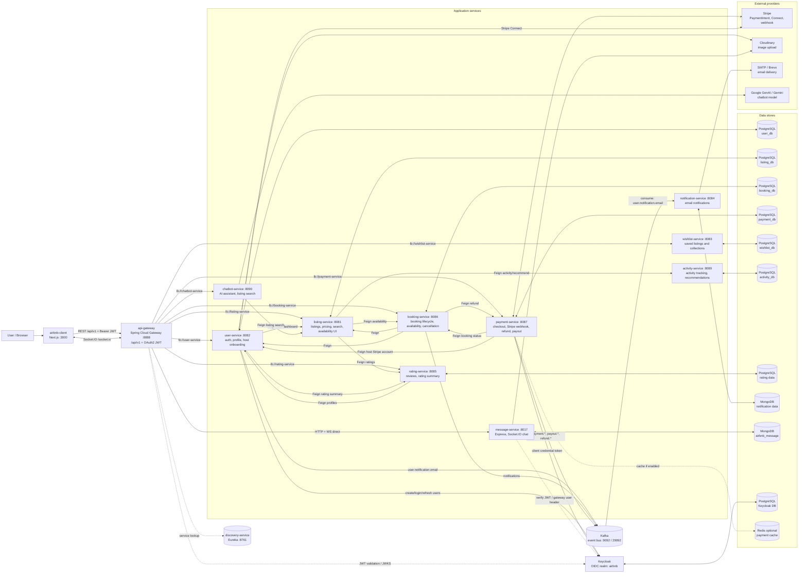
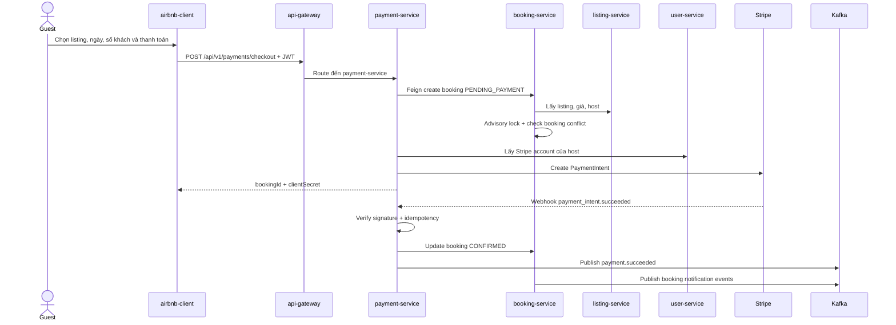

# Sơ Đồ Kiến Trúc Microservice

Tài liệu này tóm tắt kiến trúc thực tế được suy ra từ `docker-compose.yml`, các file `application.yaml`, controller, Feign client, Kafka publisher/listener và frontend config.

## 1. Sơ Đồ Tổng Quan

Bạn có thể chèn trực tiếp file SVG [microservice-architecture.svg](microservice-architecture.svg) vào PowerPoint/Google Slides. Source Mermaid nằm ở [microservice-architecture.mmd](microservice-architecture.mmd) để sửa hoặc export lại sang PNG/SVG khi cần.

## 2. Các Thành Phần Chính

| Thành phần | Vai trò |
| --- | --- |
| `airbnb-client` | Frontend Next.js. Gọi backend qua `NEXT_PUBLIC_API_BASE_URL=http://localhost:8888` và prefix `/api/v1`; dùng `socket.io-client` cho chat realtime và Stripe SDK cho thanh toán. |
| `api-gateway` | Điểm vào duy nhất cho frontend. Spring Cloud Gateway route request đến các service, validate JWT với Keycloak, cấu hình CORS, và gắn `X-Keycloak-User-Id`/`X-User-Id` cho downstream. |
| `discovery-service` | Eureka service registry. Các Spring service đăng ký vào Eureka và gateway dùng `lb://service-name` để route/load balance. |
| `keycloak` | Identity Provider cho realm `airbnb`. Cấp JWT, quản lý user/role; `user-service` gọi Keycloak để register/login/refresh/assign role. |
| `kafka` | Event bus. Đang dùng cho email welcome và các event booking/payment/refund/payout để mở rộng notification/event-driven flow. |

## 3. Vai Trò Từng Service

| Service | Port | Database / storage | Nhiệm vụ chính |
| --- | --- | --- | --- |
| `user-service` | `8082` | PostgreSQL `user_db` | Đăng ký/đăng nhập qua Keycloak, profile, public user profile, upload avatar Cloudinary, host onboarding/Stripe Connect, publish email welcome. |
| `listing-service` | `8081` | PostgreSQL `listing_db` | Quản lý listing, amenity, photo, pricing, custom pricing, house rules, availability calendar, search/filter, home sections, ghi nhận activity và aggregate rating/booking availability. |
| `booking-service` | `8086` | PostgreSQL `booking_db` | Tạo booking, check availability, chống double booking bằng PostgreSQL advisory lock, quản lý reservation, cancel/refund request, complaint/admin moderation, check-in/check-out/complete. |
| `payment-service` | `8087` | PostgreSQL `payment_db`, Redis optional | Tạo Stripe PaymentIntent, nhận webhook, cập nhật booking sang `CONFIRMED`, lưu transaction, refund, scheduler payout cho host qua Stripe Connect, publish payment events. |
| `rating-service` | `8085` | PostgreSQL rating data | Tạo/cập nhật/xóa review, tính average/summary theo listing/host, lấy public profile reviewer từ `user-service`. |
| `wishlist-service` | `8083` | PostgreSQL `wishlist_db` | Quản lý collection wishlist và item listing của user. |
| `activity-service` | `8089` | PostgreSQL `activity_db` | Lưu hành vi xem/tương tác listing và trả về gợi ý bằng collaborative filtering. |
| `notification-service` | `8084` | MongoDB + SMTP/Brevo | Gửi email trực tiếp và consume topic `user.notification.email` để gửi welcome email. |
| `message-service` | `8017` | MongoDB `airbnb_message`, Cloudinary | Service Node/Express cho conversation, message, upload file, realtime Socket.IO. Gateway route `/api/v1/conversations`, `/api/v1/messages` và `/socket.io/**` đến service này. |
| `chatbot-service` | `8090` | In-memory chat memory | Spring AI chatbot dùng Gemini, stream câu trả lời và gọi `listing-service` để tìm listing/kiểm tra ngày trong hội thoại. |

## 4. Cách Các Service Giao Tiếp

- Frontend -> Gateway: REST qua `http://localhost:8888/api/v1/...` và WebSocket/Socket.IO qua `/socket.io/**`.
- Gateway -> Spring services: Spring Cloud Gateway route `lb://...` thông qua Eureka.
- Gateway -> `message-service`: route HTTP/WS trực tiếp đến `message-service:8017`, vì service Node không đăng ký Eureka trong `docker-compose.yml`.
- Service -> service đồng bộ: Spring OpenFeign. Các cặp quan trọng gồm Booking -> Listing/User/Payment, Payment -> Booking/User/Keycloak, Listing -> Booking/Rating/Activity, Rating -> User, Chatbot -> Listing.
- Event bất đồng bộ: Kafka. `user-service` publish `user.notification.email`; `notification-service` consume topic này. `booking-service` và `payment-service` publish thêm `notifications`, `payment.succeeded`, `payout.completed`, `refund.completed`, `refund.failed` để phục vụ notification/analytics/reconciliation.
- Authentication: Keycloak cấp JWT. Gateway validate JWT bằng issuer/JWKS, các Spring service cũng cấu hình OAuth2 Resource Server để tự validate khi bị gọi trực tiếp. Gateway forward user id trong header cho downstream.

## 5. Luồng Hoạt Động Tổng Quan

1. Đăng ký/đăng nhập: client gọi `/api/v1/users/auth/register` hoặc `/login` qua Gateway. `user-service` gọi Keycloak tạo user/cấp token, lưu profile vào `user_db`, sau đó publish Kafka event `user.notification.email`; `notification-service` consume event và gửi email welcome.
2. Xem và tìm phòng: client gọi `/api/v1/listings/**`. `listing-service` đọc `listing_db`, khi cần thì gọi `rating-service` để lấy điểm đánh giá, `booking-service` để check availability, và `activity-service` để lưu hành vi hoặc lấy recommendation.
3. Đặt phòng và thanh toán: client gọi `/api/v1/payments/checkout`. `payment-service` gọi `booking-service` tạo booking `PENDING_PAYMENT`; `booking-service` lấy listing từ `listing-service`, lock theo `listingId` và check conflict. Sau đó `payment-service` lấy Stripe account của host từ `user-service`, tạo PaymentIntent trên Stripe và trả `clientSecret` cho client.
4. Xác nhận thanh toán: Stripe gọi webhook `/api/v1/payments/webhook`. `payment-service` verify signature, chống duplicate bằng `stripe_webhook_events`, cập nhật payment thành `PAID`, gọi `booking-service` cập nhật booking thành `CONFIRMED`, tạo transaction/payout và publish `payment.succeeded`.
5. Sau khi khách check-in/check-out: `booking-service` cập nhật lifecycle booking. `payment-service` có scheduler xử lý payout đến hạn, tạo Stripe Transfer cho host và publish `payout.completed`.
6. Chat realtime: client gọi conversation/message qua Gateway đến `message-service`; Socket.IO dùng `/socket.io/**` để join user room/conversation room và emit message/typing/notification realtime.
7. Chatbot: client gọi `/api/v1/chatbot/stream`; `chatbot-service` dùng Gemini để tạo câu trả lời, đồng thời gọi `listing-service` để search listing và check availability theo nội dung hỏi.

## 6. Ghi Chú Khi Thuyết Trình

- Hệ thống theo mô hình database-per-service cho các domain chính: user, listing, booking, payment, wishlist, activity; message/notification dùng MongoDB. `rating-service` đang cấu hình env mặc định trỏ về `listing_db`, có thể xem là logical data riêng cho rating.
- Gateway là lớp bảo vệ và định tuyến request, còn Eureka giải quyết service discovery cho các Spring service.
- Booking/payment không dùng distributed transaction. Luồng thanh toán dựa vào local transaction, webhook idempotency, Kafka event và reconciliation/scheduler để đạt eventual consistency.
- Trong source hiện tại, `notification-service` mới có Kafka consumer rõ ràng cho `user.notification.email`; topic `notifications` từ booking/payment đã được publish nhưng chưa thấy consumer tương ứng trong code.

## 7. Sequence Booking-Payment Để Đưa Vào Slide Riêng

